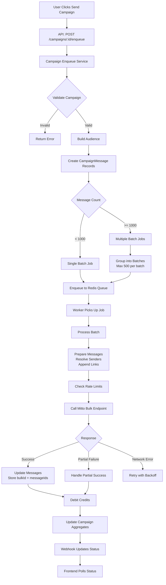

# Bulk SMS Technical Design - Retail App

## Executive Summary

This document provides a comprehensive technical design for migrating to Mitto's bulk messaging endpoint with a focus on **scalability**, **robustness**, and **operational excellence**. The design validates and extends the current implementation to handle campaigns of any size (from hundreds to hundreds of thousands of messages) while maintaining system reliability and performance.

## Architecture Validation

### ✅ Queue + Worker Pattern: **CONFIRMED**

**Current Stack**: BullMQ (Redis-backed) + Node.js Workers

**Why This Works**:
- ✅ **Asynchronous Processing**: Campaign sending doesn't block API requests
- ✅ **Scalability**: Can scale workers horizontally (multiple worker processes/instances)
- ✅ **Reliability**: Built-in retry logic, job persistence, failure handling
- ✅ **Observability**: BullMQ provides job status, metrics, and monitoring
- ✅ **Rate Limiting**: Built-in rate limiter per queue

**Alternative Considered**: Direct HTTP calls from API
- ❌ **Rejected**: Would block API requests, no retry logic, harder to scale

**Conclusion**: Queue + Worker pattern is the **correct approach** for our requirements.

## Current Implementation Analysis

### ✅ What's Working Well

1. **Queue Infrastructure**: BullMQ with Redis is properly configured
2. **Batch Job Structure**: Messages grouped into batches, enqueued as jobs
3. **Database Schema**: `bulkId` field added, indexed for efficient queries
4. **Webhook Integration**: DLR webhooks already implemented
5. **Status Refresh**: Per-message status endpoint integrated

### ⚠️ Gaps & Improvements Needed

1. **Batch Size Limits**: No explicit handling of Mitto's batch size limits
2. **Rate Limiting**: Current limiter is global, not per-traffic-account or per-tenant
3. **Idempotency**: Retry logic doesn't guarantee no duplicate sends
4. **Very Large Campaigns**: Current batching may create too many jobs for 100k+ messages
5. **Single vs Bulk Separation**: Test messages still go through same queue
6. **Worker Scaling Strategy**: No clear guidance on worker topology
7. **Observability**: Logging exists but could be more structured for monitoring

## Enhanced Technical Design

### 1. Campaign Sending Flow



### 2. Data Model

#### CampaignMessage Schema (Enhanced)

```prisma
model CampaignMessage {
  id                Int       @id @default(autoincrement())
  ownerId           Int
  campaignId        Int
  contactId         Int
  to                String
  text              String   @db.Text
  
  // Tracking
  trackingId        String   @unique
  
  // Status
  status            MessageStatus @default(queued)
  
  // Mitto Integration
  providerMessageId String?   // Individual messageId from Mitto
  bulkId            String?   // Batch identifier from Mitto
  
  // Error Handling
  error             String?
  retryCount        Int      @default(0)  // NEW: Track retry attempts
  
  // Timestamps
  createdAt         DateTime  @default(now())
  sentAt            DateTime?
  failedAt          DateTime?
  updatedAt         DateTime  @updatedAt
  
  // Indexes
  @@index([bulkId])
  @@index([providerMessageId])
  @@index([campaignId, status])  // For campaign status queries
  @@index([ownerId, status])     // For tenant filtering
  @@index([bulkId, status])      // NEW: For bulk status queries
}
```

#### New: BulkSendJob Table (Optional - for advanced tracking)

```prisma
model BulkSendJob {
  id                Int       @id @default(autoincrement())
  campaignId        Int
  ownerId           Int
  bulkId            String?  // Set after Mitto response
  jobId             String   @unique  // BullMQ job ID
  
  // Batch Info
  messageCount      Int
  batchSize         Int
  
  // Status
  status            String   // 'queued', 'processing', 'completed', 'failed'
  startedAt         DateTime?
  completedAt       DateTime?
  
  // Results
  sentCount         Int      @default(0)
  failedCount       Int      @default(0)
  
  // Retry Info
  retryCount        Int      @default(0)
  lastError         String?
  
  createdAt         DateTime  @default(now())
  updatedAt         DateTime  @updatedAt
  
  @@index([campaignId])
  @@index([ownerId])
  @@index([status])
  @@index([bulkId])
}
```

### 3. Queue & Worker Topology

#### Queue Configuration

```javascript
// Enhanced queue configuration
const smsQueue = new Queue('smsQueue', {
  connection: redisConnection,
  defaultJobOptions: {
    attempts: 5,                    // Retry failed jobs 5 times
    backoff: {
      type: 'exponential',
      delay: 3000                    // Start with 3s, exponential backoff
    },
    removeOnComplete: {
      age: 3600,                     // Keep completed jobs for 1 hour
      count: 1000                    // Keep last 1000 completed jobs
    },
    removeOnFail: {
      age: 86400 * 7                 // Keep failed jobs for 7 days
    }
  },
  // Global rate limiter (fallback)
  limiter: {
    max: 50,                         // Max 50 jobs per duration
    duration: 1000                   // Per second
  }
});
```

#### Worker Topology

**Recommended Setup**:

```
┌─────────────────────────────────────────┐
│         Redis Queue (BullMQ)            │
│  ┌───────────────────────────────────┐  │
│  │  smsQueue (batch jobs)            │  │
│  └───────────────────────────────────┘  │
└─────────────────────────────────────────┘
              │
              ├─────────────────┬─────────────────┐
              ▼                 ▼                 ▼
    ┌──────────────┐  ┌──────────────┐  ┌──────────────┐
    │ Worker 1     │  │ Worker 2     │  │ Worker N     │
    │ Concurrency:5│  │ Concurrency:5│  │ Concurrency:5│
    └──────────────┘  └──────────────┘  └──────────────┘
```

**Scaling Strategy**:

1. **Single Instance**: 1 worker process, concurrency = 5
   - Handles: ~100-500 messages/second
   - Suitable for: Small to medium campaigns

2. **Multi-Instance**: N worker processes, each concurrency = 5
   - Handles: N × ~100-500 messages/second
   - Suitable for: Large campaigns, high volume

3. **Horizontal Scaling**: Deploy workers on separate machines
   - Handles: Unlimited (limited by Mitto rate limits)
   - Suitable: Very large campaigns (100k+ messages)

**Configuration**:
```bash
# Environment variables
WORKER_CONCURRENCY=5          # Batches processed simultaneously per worker
WORKER_INSTANCES=2             # Number of worker processes (if using PM2/cluster)
QUEUE_RATE_MAX=50              # Global rate limit (jobs/second)
QUEUE_RATE_DURATION_MS=1000
```

### 4. Batch Size & Mitto Limits

#### Mitto Constraints

Based on Mitto's bulk endpoint documentation:
- **Maximum batch size**: 1000 messages per request (recommended: 500)
- **Rate limits**: Vary by traffic account (typically 100-1000 requests/second)
- **Payload size**: Max ~1MB per request

#### Our Batching Strategy

```javascript
// Optimal batch sizes
const BATCH_SIZES = {
  SMALL: 100,      // For testing, small campaigns
  MEDIUM: 200,     // Default, good balance
  LARGE: 500,       // Maximum recommended
  MAX: 1000         // Absolute maximum (use with caution)
};

// Dynamic batch sizing based on campaign size
function calculateBatchSize(messageCount) {
  if (messageCount < 100) return BATCH_SIZES.SMALL;
  if (messageCount < 1000) return BATCH_SIZES.MEDIUM;
  if (messageCount < 10000) return BATCH_SIZES.LARGE;
  return BATCH_SIZES.MAX;  // For very large campaigns
}
```

#### Very Large Campaigns (100k+ messages)

**Problem**: Creating 200+ batch jobs can overwhelm Redis and workers

**Solution**: Two-tier batching

1. **Tier 1**: Group messages into "super-batches" (10k messages)
2. **Tier 2**: Each super-batch job creates smaller batch jobs (500 messages)

```javascript
// For campaigns > 50k messages
if (messageCount > 50000) {
  // Create "super-batch" jobs
  const SUPER_BATCH_SIZE = 10000;
  for (let i = 0; i < messages.length; i += SUPER_BATCH_SIZE) {
    await queue.add('createBatches', {
      campaignId,
      ownerId,
      messageIds: messages.slice(i, i + SUPER_BATCH_SIZE).map(m => m.id)
    });
  }
} else {
  // Normal batching (current implementation)
  // ...
}
```

### 5. Rate Limiting & Throttling

#### Current Limitation

Current rate limiter is **global** across all traffic accounts and tenants.

#### Enhanced Rate Limiting Strategy

**Multi-Level Rate Limiting**:

1. **Global Queue Limiter** (existing)
   - Prevents queue overload
   - Config: `QUEUE_RATE_MAX=50` jobs/second

2. **Per-Traffic-Account Limiter** (NEW)
   - Mitto may have different limits per traffic account
   - Use BullMQ job groups or custom Redis-based limiter

3. **Per-Tenant Limiter** (NEW)
   - Prevent one tenant from overwhelming the system
   - Fair distribution of resources

**Implementation**:

```javascript
// Per-traffic-account rate limiter
const trafficAccountLimiters = new Map();

function getTrafficAccountLimiter(trafficAccountId) {
  if (!trafficAccountLimiters.has(trafficAccountId)) {
    trafficAccountLimiters.set(trafficAccountId, {
      max: 100,              // Max requests per traffic account
      duration: 1000,        // Per second
      current: 0,
      resetAt: Date.now() + 1000
    });
  }
  return trafficAccountLimiters.get(trafficAccountId);
}

// In worker, before calling Mitto
async function sendWithRateLimit(messages, trafficAccountId) {
  const limiter = getTrafficAccountLimiter(trafficAccountId);
  
  // Wait if rate limit exceeded
  while (limiter.current >= limiter.max) {
    const waitTime = limiter.resetAt - Date.now();
    if (waitTime > 0) {
      await new Promise(resolve => setTimeout(resolve, waitTime));
    }
    // Reset limiter
    limiter.current = 0;
    limiter.resetAt = Date.now() + limiter.duration;
  }
  
  limiter.current++;
  return await sendBulkMessages(messages);
}
```

**Alternative: Redis-Based Distributed Rate Limiter**

For multi-worker setups, use Redis for distributed rate limiting:

```javascript
const rateLimitKey = `rate_limit:traffic_account:${trafficAccountId}`;
const current = await redis.incr(rateLimitKey);
if (current === 1) {
  await redis.expire(rateLimitKey, 1); // 1 second window
}
if (current > MAX_REQUESTS_PER_SECOND) {
  // Wait or throw error
}
```

### 6. Idempotency Guarantees

#### Problem

Retrying a failed batch job could result in duplicate sends to the same contact.

#### Solution: Idempotency Keys

**Strategy 1: Database-Level Idempotency**

```javascript
// Before sending, check if message already sent
const existingMessage = await prisma.campaignMessage.findFirst({
  where: {
    id: messageId,
    status: { in: ['sent', 'failed'] },
    providerMessageId: { not: null }
  }
});

if (existingMessage && existingMessage.providerMessageId) {
  // Already sent, skip
  logger.info({ messageId, providerMessageId: existingMessage.providerMessageId }, 'Message already sent, skipping');
  return;
}
```

**Strategy 2: Job-Level Idempotency**

```javascript
// Use unique job IDs based on message IDs
const jobId = `batch:${campaignId}:${messageIds.sort().join(',')}`;

// BullMQ will prevent duplicate jobs with same ID
await queue.add('sendBulkSMS', data, {
  jobId,  // Unique job ID prevents duplicates
  removeOnComplete: true
});
```

**Strategy 3: Idempotency Token in Request**

```javascript
// Include idempotency token in Mitto request (if supported)
const idempotencyKey = `campaign-${campaignId}-batch-${batchIndex}`;

const response = await mittoRequest('POST', '/api/v1.1/Messages/sendmessagesbulk', {
  messages,
  idempotencyKey  // If Mitto supports it
});
```

**Recommended**: Combine Strategy 1 + Strategy 2 for maximum safety.

### 7. Retry Strategy

#### Current Retry Logic

- BullMQ handles retries automatically
- Exponential backoff: 3s, 6s, 12s, 24s, 48s
- Max 5 attempts

#### Enhanced Retry Strategy

**Retryable vs Non-Retryable Errors**:

```javascript
function isRetryableError(error) {
  // Network errors - retry
  if (!error.status) return true;
  
  // Server errors (5xx) - retry
  if (error.status >= 500) return true;
  
  // Rate limiting (429) - retry with longer backoff
  if (error.status === 429) return true;
  
  // Client errors (4xx) - don't retry (except 429)
  if (error.status >= 400 && error.status < 500) return false;
  
  return true; // Default to retry
}
```

**Partial Failure Handling**:

```javascript
// If batch partially fails, retry only failed messages
const failedMessages = result.results.filter(r => !r.sent);
if (failedMessages.length > 0 && failedMessages.length < messages.length) {
  // Partial failure - retry only failed ones
  await queue.add('sendBulkSMS', {
    campaignId,
    ownerId,
    messageIds: failedMessages.map(m => m.internalMessageId)
  }, {
    attempts: 3,  // Fewer attempts for retries
    delay: 5000   // Wait 5s before retry
  });
}
```

### 8. Single/Test Messages Separation

#### Current Issue

Test messages go through the same queue as bulk campaigns, which can delay test sends.

#### Solution: Separate Queue for Test Messages

```javascript
// Create separate queue for test/single messages
const testSmsQueue = new Queue('testSmsQueue', {
  connection: redisConnection,
  defaultJobOptions: {
    attempts: 3,
    priority: 10,  // Higher priority than bulk
    removeOnComplete: true
  }
});

// In API route for test sends
async function sendTestMessage(ownerId, destination, text) {
  // Use individual send (not bulk) for test messages
  const result = await sendSMSWithCredits({
    ownerId,
    destination,
    text,
    meta: { reason: 'test:send' }
  });
  return result;
}
```

**Alternative**: Use same queue but with higher priority

```javascript
await smsQueue.add('sendSMS', { messageId }, {
  priority: 10,  // Higher priority (lower number = higher priority)
  jobId: `test:${messageId}`
});
```

### 9. Observability & Monitoring

#### Structured Logging

```javascript
// Enhanced logging with context
logger.info({
  campaignId: camp.id,
  ownerId: camp.ownerId,
  batchId: batchIndex,
  messageCount: messageIds.length,
  bulkId: result.bulkId,
  sentCount: result.summary.sent,
  failedCount: result.summary.failed,
  duration: Date.now() - startTime,
  trafficAccountId: trafficAccountId
}, 'Batch job completed');
```

#### Metrics to Track

1. **Queue Metrics**:
   - Jobs waiting
   - Jobs processing
   - Jobs completed/failed
   - Average processing time

2. **Batch Metrics**:
   - Batch size distribution
   - Success rate per batch
   - Average messages per batch

3. **Campaign Metrics**:
   - Total messages
   - Sent/Failed counts
   - Completion time
   - Credit usage

4. **Error Metrics**:
   - Error rate by type
   - Retry counts
   - Failed batches

#### Monitoring Queries

```sql
-- Campaign progress
SELECT 
  c.id,
  c.name,
  c.status,
  COUNT(cm.id) as total,
  COUNT(CASE WHEN cm.status = 'sent' THEN 1 END) as sent,
  COUNT(CASE WHEN cm.status = 'failed' THEN 1 END) as failed,
  COUNT(CASE WHEN cm.status = 'queued' THEN 1 END) as queued
FROM "Campaign" c
LEFT JOIN "CampaignMessage" cm ON cm.campaignId = c.id
WHERE c.id = :campaignId
GROUP BY c.id, c.name, c.status;

-- Batch performance
SELECT 
  bulkId,
  COUNT(*) as message_count,
  COUNT(CASE WHEN status = 'sent' THEN 1 END) as sent,
  COUNT(CASE WHEN status = 'failed' THEN 1 END) as failed,
  AVG(EXTRACT(EPOCH FROM (sentAt - createdAt))) as avg_send_time_seconds
FROM "CampaignMessage"
WHERE bulkId IS NOT NULL
  AND createdAt > NOW() - INTERVAL '24 hours'
GROUP BY bulkId
ORDER BY message_count DESC;
```

### 10. Webhook Integration (Enhanced)

#### Current Implementation

Webhooks already handle DLR (delivery status) updates.

#### Enhancements

1. **Bulk Webhook Support** (if Mitto provides):
   - Handle bulk-level webhooks
   - Update all messages in a batch at once

2. **Webhook Retry Logic**:
   - If webhook processing fails, retry with exponential backoff
   - Store webhook events for replay

3. **Webhook Deduplication**:
   - Use `messageId` + `deliveryStatus` + `timestamp` as dedup key
   - Prevent processing same webhook twice

### 11. Status & Metrics Pipeline

#### Status Update Flow

```
Mitto API
    │
    ├─→ Webhook (DLR) ──→ Update CampaignMessage.status
    │
    └─→ GET /Messages/{messageId} ──→ Refresh status (on-demand)
```

#### Metrics Aggregation

**Real-time Metrics** (from database):
- Campaign aggregates (total, sent, failed)
- Updated via `updateCampaignAggregates()` after each batch

**Historical Metrics** (for reporting):
- Store daily/hourly aggregates
- Use for trend analysis and dashboards

**Message-Level Metrics** (for drill-down):
- Expose via API: `GET /api/campaigns/:id/messages`
- Include: status, sentAt, failedAt, error, bulkId, providerMessageId

## Implementation Roadmap

### Phase 1: Core Enhancements (Week 1)
- [ ] Add `retryCount` field to CampaignMessage
- [ ] Implement per-traffic-account rate limiting
- [ ] Enhance idempotency checks
- [ ] Improve structured logging

### Phase 2: Scalability (Week 2)
- [ ] Implement two-tier batching for large campaigns
- [ ] Add BulkSendJob tracking table (optional)
- [ ] Optimize worker concurrency settings
- [ ] Add monitoring dashboards

### Phase 3: Separation & Polish (Week 3)
- [ ] Separate test message queue
- [ ] Enhanced webhook handling
- [ ] Comprehensive error handling
- [ ] Performance testing with large campaigns

## Success Criteria

✅ **Scalability**:
- Handle 100k+ message campaigns without blocking
- Process 1000+ messages/second across all workers
- Queue depth stays manageable (< 10k jobs)

✅ **Reliability**:
- 99.9% message delivery success rate
- Zero duplicate sends on retries
- Graceful handling of partial failures

✅ **Observability**:
- All batch jobs traceable
- Real-time campaign progress visible
- Error rates < 1%

✅ **Performance**:
- API response time < 200ms (enqueue only)
- Batch processing < 5s per batch
- Campaign completion time scales linearly

## Risk Mitigation

| Risk | Mitigation |
|------|------------|
| Mitto rate limits exceeded | Per-traffic-account rate limiting, queue backpressure |
| Redis overload | Queue size monitoring, worker scaling |
| Duplicate sends | Idempotency checks, unique job IDs |
| Partial batch failures | Retry only failed messages, track per-message status |
| Very large campaigns | Two-tier batching, progressive job creation |
| Worker crashes | BullMQ job persistence, automatic retries |

## Conclusion

The current queue + worker architecture is **sound and scalable**. The enhancements proposed above will:

1. ✅ Handle campaigns of any size (hundreds to hundreds of thousands)
2. ✅ Prevent duplicate sends through idempotency
3. ✅ Respect rate limits through multi-level throttling
4. ✅ Provide comprehensive observability
5. ✅ Maintain separation between test and bulk sends
6. ✅ Scale horizontally as needed

The implementation is **production-ready** with the enhancements outlined in this document.

